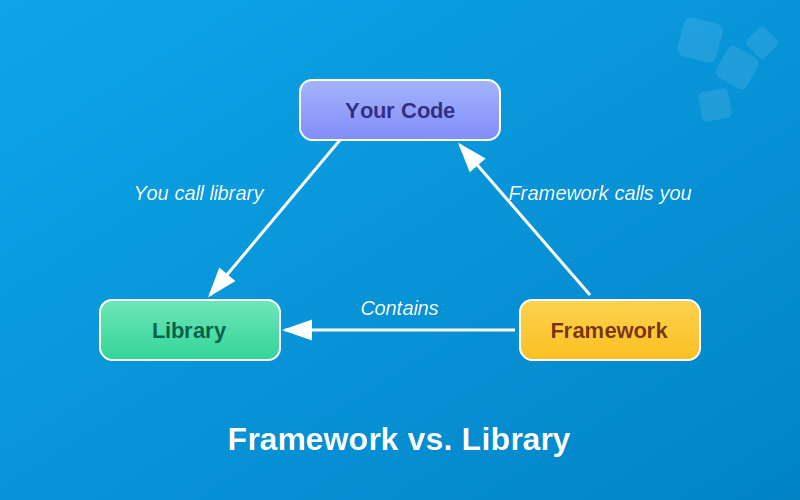
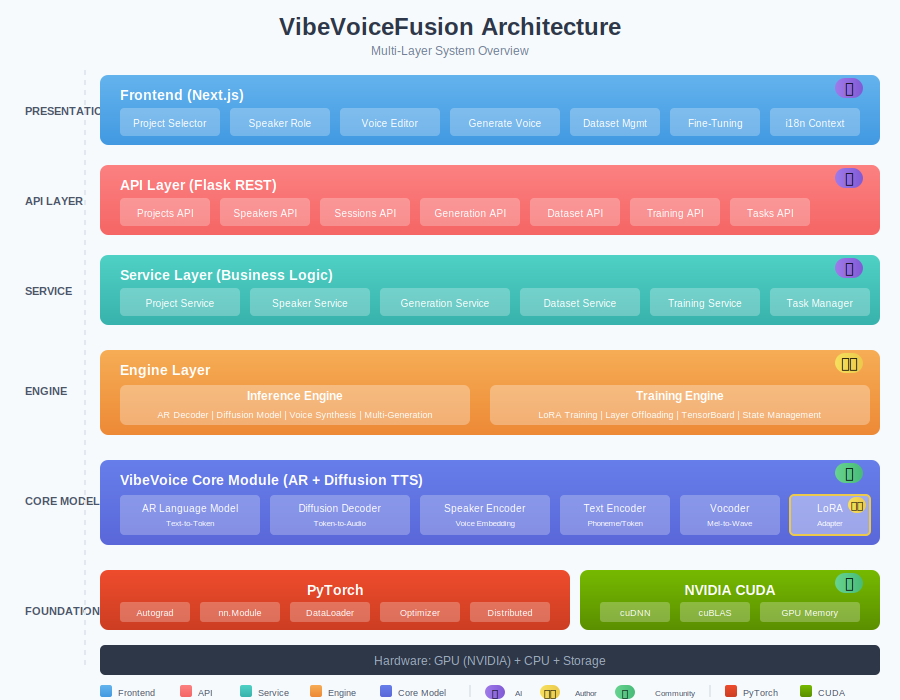
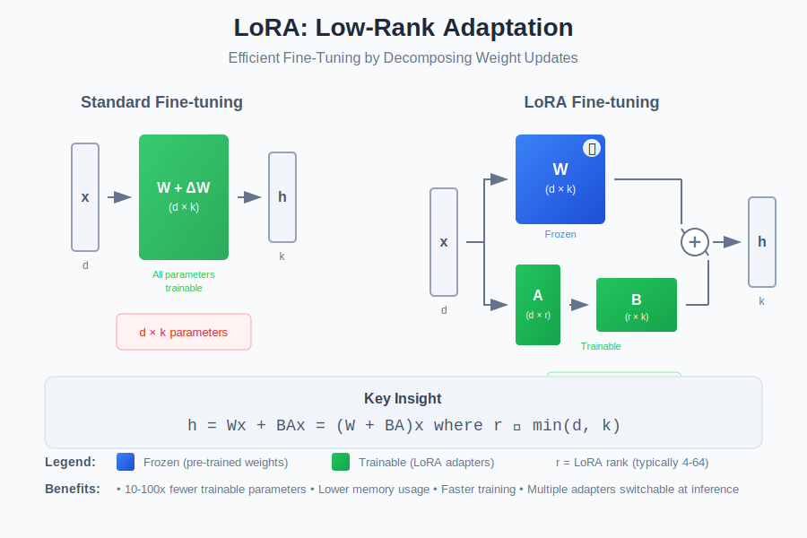

## VibeVoiceFusion 开发感悟

写在前面的话， 这篇文章主要是我开发[VibeVoiceFusion](https://github.com/zhao-kun/VibeVoiceFusion) 这个项目的一些体会, 经验以及收获。本文的写作是百分百的古法写作方法，整篇文字的AI含量0，全人工书写（部分图片使用了AI生成）。因此可以放心阅读。由于没有做过任何AI的润色和修改，所以可能存在个别错误情况，也请大家见谅。

如今VibeVoiceFusion的v2.0.0的功能已经全部开发完成，它是一个集推理训练管理的全栈解决方案。目前在Github上收获了409个star （截至这篇文章编写为止）。也得到社区一些用户的反馈和好评。这里再给我的这个side project做个广告，欢迎大家去帮我点免费的小星星。

### 引子

今年的9月下旬一个偶然的机会看到微软发了一个语音生成模型 VibeVoice， 具有**生成长时间音频**和**多人对话**的能力，而且模型还会根据文字中的含义自动将读者的语调情绪带入到生成语音中。当时就觉得这个模型非常不错，但是因为那个时候比较忙也没有抽出手来具体研究，就不了了之了。结果后续微软的一通骚操作反而激起我对这个模型探索的动力。

起因是微软在Huggingface上发布了这个模型的两个版本，一个15亿参数 VibeVoice-1.5B和一个70亿参数的模型 VibeVoice-Large-7B， 并且在github上发布了推理代码和一小部分训练代码。但是大约两周后，微软把推理代码和70亿参数的这个模型给删除。（删除的原因不太知道是为什么，也许他们自己觉得模型的能力不错，怕被那些心术不正的人误用）。即便模型被删除了， 社区还是有很多人提前做了备份， 想必很多人也很关注这个模型。所以在微软删除了代码和模型后，社区随即就在Huggingface和github放出了他们克隆的这个70亿参数的模型和推理代码。

由于当时我在做一个GPU调度和租赁平台，想找一些不错的GPU推理应用。 所以把一些好的模型，并且对资源使用又不是这么大的模型，集成并封装成一个应用能让大家一键就能使用，便是我当时想做的东西。于是我着手开发

### 开发

#### 框架还是类库，这是个问题！

<div align="center">
  
</div>

在我动手的第一步，我决定先解决的问题是剥离框架！

当然我不会剥离pytorch 框架，毕竟它是机器学习最最最基础的东西，如果直接去掉pytorch框架，那么要自己做的东西就太多太多了。 但是最早的Microsoft的源代码里面是依赖transformers框架的。 我要剥离的框架就是它，原因是：

- **复杂性太高**， huggingface的transformers框架几乎支持市面上所有开源的LLM模型，框架里面的实现考虑到对各种异构模型的兼容性支持，复杂简没法看。 我的诉求就是一个专门给VibeVoice模型推理的程序。 没有必要引入这种复杂性， 确保他只基于pytorch框架足够了。
- **缺少灵活性**，要让这个应用能让大部分有消费级显卡的GPU都能运行起来，肯定是需要做显存优化的。量化是必须的，甚至是能要做offloading, 如果依赖了transformers 可能整个模型就被陷在那个框架里面了，想要随我所想的修改，就会容易被框架的条条框框被限制住。另外学习框架也还耗时间了。
- **易用性差**， 微软提交给huggface的模型有接近10几个文件，除了模型文件，还有各种各样的元信息文件。实在太不方便用于打包交付了。最近这一两年，我一直都在生图的开源软件，比如ComfyUI。在ComfyUI里面的做法就是将很多huggingface发布的模型做一个 repackage，就是把多个模型压缩成一个文件， 以方便用户使用。ComfyUI的用户几乎很少接触计算机，要让用户使用`hf download`命令去下载模型文件，然后再一个个文件下载来然后拷贝到目录下，那就太麻烦和不方便。对于它的用户计算机水平来说也太难。于是ComfyUI的做法就是把大部分的huggingface模型做 repackage来降低使用的复杂性。所以我肯定是也要做类似的工作的。

但是，transformers提供的一些工具类，帮助类函数我仍然会使用，这样我就会以类库的形式来使用transformers，而不是通过框架形式。因此可以降低整个改造的负担。

基于上面的原因，我开修改微软提交的VibeVoice核心推理代码。 VibeVoice模型里面有一个基于Qwen2.5的大语言模型, 所以改起来也很简单，毕竟网上资料很多，很快我就把模型的代码改完。改完代码后，我还担心会出现pytorch里面经典的`RuntimeError: mat1 and mat2 shapes cannot be multiplied` 没有想到情况居然好的出奇，执行的推理代码没有任何报错的跑完。 激动的心，颤抖的手，点开了生成音频文件，然而没有想到……。

#### 神奇的随机数（噪声）

- **问题出现**：音频文件是虽然是成功的生成了，然而听到的声音却不是人发出的语音，是一些听不清楚的声音。这个要如何开始查？是不是模型改坏了， 还是什么问题？简直是一团乱麻，反反复复的检查了代码，觉得应该不是代码问题。多年的开发经验告诉我，现在能解决问题的方法就只有调试了。毕竟在随机种子固定的情况，每个模型的输入一样，不管在什么样的机器上，产生的输出就一定一样。

- **问题定位**：在确定方向后，我找到未修改的代码和模型跑了一遍。原模型准确无误的生成的了文本内容对应的语音。于是我同时运行了两个程序，对比程序过程中每一次tensor变量的输出的差异。才开始还好，但是在中间一次的取随机数的调用中，产生的的随机tensor变量的内容居然完全不一样。于是我把原版的tensor变量offload到文件里面，在我修改的程序里面去装载这些变量。结果，这一轮的产生的输出居然一样。 那么问题就基本定位了。模型程序的修改没有问题，有问题的应该是随机噪声产生的不对。

- **尝试解决**: 问题基本定位了，那么在种子固定的情况为啥随机噪声不对呢？其实在这个随机tensor取值之前，代码还取了两次随机数。而这两个随机数在新老程序中得到都是一样的值。按理说在种子固定的情况下，应该所有的随机值都一样。但是第三次取随机数的结果却不符预期，只能再次检查代码。发现几次取随机数还是有一定的差别，前面两次都是在cuda设备上去的随机数，而后面不一致的却是在CPU设备上的随机数。所以看上去在程序开头指定的随机数种子的调用并没有在所有设备上生效，最终通过这提交[提交](https://github.com/zhao-kun/VibeVoiceFusion/commit/c8d903fcb5ea7390899116617646668d9c5073e0) 修复了这个问题。(pytorch 是支持在所有设备上指定随机数，为啥没有生效？为啥原来代码没有这样明确的在这里指定随机数生成器。到目前为止，我也没有搞明白，如果有高手能指点一下就好了）。

#### 显存优化

前面说过，要让这个应用能在大部分消费级显卡上跑起来。在不做任何显存优化的前提下，跑70亿参数的模型，至少需要4090以及以上的GPU, 最少的显存应该17GB左右。所以必须要降低显存的最低需求。显存优化就是我想做的第一个VibeVoice模型增强。

**目标**:

在修复了随机数的问题后， 我终于得到了和原版模型的一样的生成语音效果。 于是我repackage的模型， 将原来的多个模型文件合并成了一个大模型文件19个GB左右。我一直都希望能够在本地的RTX 1060GB的机器上尝试跑这个模型，所以下一个目标就是如何在推理阶段做到显存优化。能让这个7B的模型在尽量少的显存的机器上能运行起来。主要的思路有两个：

**思路1: 量化(quantization)**:

业界在显存优化的手段主要有两个，一个是量化，把原来用单精度(fp32 4个字节32位)的表示一个参数值变成半精度(fp16, bfloat16 2个字节16位)或者1个字节(float8, int8) 来表示,甚至4个bit (int4, bnb4 半个字节), 来表示一个参数。 这种方式能大量节省显存， 但是精度的降低也会导致模型的性能下降。

pytorch 提供了原生的量化支持， 可以直接把量化成float8和int8, 我最近两年比较多的接触了[ComfyUI](https://github.com/comfyanonymous/ComfyUI), 看到很多ComfyUI的repackage模型都是float8_e4m3fn (float8 量化)格式保存文件。 所以我想到的显存优化的第一个方法就是像ComfyUI一样做成float8_e4m3fn方式的进行量化，这样至少能节省一半的显存。但是当我真正开始实现后才知道虽然pytorch 能原生支持任何类型量化成 float8_e4m3fn，但是真要使用这玩意，却非常的麻烦。这是因为各种硬件支持以及float8计算的限制， 所以这个类型只能被用于做存储来降低对磁盘容量的要求，因为这个类型不支持直接的张量计算。 如果要直接使用必须用一些trick的手段。当初用它的时候发现float8不能直接进行算术运算也是一度让我非常迷惑。 在接触这个东西之前，一直认为这些都理所当然的东西。 但是在上手写代码调试的时候，才知道事情不同想象的那么简单。带着这样的困惑我去翻看了ComfyUI的[代码](https://github.com/comfyanonymous/ComfyUI/blob/master/comfy/ops.py)，明白了如果使用float8_e4m3fn 这样的类型，则必须在计算时做转换，把float8 再转换回到半精度类型。 具体来说，就是当你在计算一个线性层时torch.nn.Linear，再把这个线性层转换成半精度(bfloat16)类型。即便在运算时还是单精度类型，但是因为只有在计算时才转换，实际上还是大大的减少的显存的使用。不过这样的方式对硬件还是有一定要求，只有RTX 40系以上的显卡才能支持。所以我还需要其他的方式继续降低显存的使用。

**思路2: 卸载显存(offloading)**:

接下来，就是offloading机制。 总体来说offloading 就是在计算时，把计算完成的内容放到内存里面， 而在计算时再从内存加到显存里面。我知道这个方法是因为之前使用kohay的[训练器](https://github.com/kohya-ss/musubi-tuner)的经历。所以，想既然DiT架构可以这么做，那么VibeVoice本身也包含一个28层的transformer模型，那么应该也可以这么做来实现显存优化。这部分代码大部分逻辑是让Claude Code实现的，整体逻辑的执行就如同这个视频展示的一样

<div align="center">
  <a href="https://www.youtube.com/watch?v=zqtqH4V-bdU">
   
  </a>
</div>

> 感谢3Blue1Brown提供的开源库：https://github.com/3b1b/manim 使每个人做动画成为了可能。

通过AI写的代码有很多问题，写好的第一版在推理速度上非常的差，比不offloading慢了几倍甚至十几倍。最后我把kohya的代码给AI进行参考，他才找到优化的方法。最终版的推理速度，达到一个基本可以接受的水平。关于AI辅助编程来实现这个功能的过程，我记录在了我公众号文章[《AI编程奇遇记：一次“磨人”的显存优化之旅》](https://mp.weixin.qq.com/s/9IERd9mBEmrfULPNz8uOaw) 里面了， 大家有兴趣的可以去看看。

#### AI辅助编程 Vibe Coding

2025年，AI辅助编程 Vibe Coding 是一个绕不开的话题。只要是程序员或多或少的都在使用AI辅助编程。 这一年我也尝试了很多的这样的工具。 其中包括有VSCode的Copilot和Antropic 的Claude Code（简称 CC）。CC给我的体验尤为惊艳。他基本能稳定的完成一般性的程序员工作，比如一些模板代码的编写。下面这张图里面，有多少使用了AI辅助编程，由这个🤖图标标识。有多少是由我手工开发的，由这个🧑‍💻图标标识。多少是社区原有的代码，由这个👥图标标识。

<div align="center">
  
</div>

可以看到，我对于AI的使用即克制又恣意， 具体的我的使用可以分如下的几种情况。 

- **前端代码:** 特别是前端表示层。早期的React，我还写过一些代码， 如今的Next.js是一点都不懂。所以把这个部分代码完整的托管给AI, 针对这个部分的代码，我角色就是一个黑盒测试人员以及产品经理（而且是要五彩斑斓黑的那种）。只有发现了不符合预期的部分我会让他做修改。 很少关注这部分的代码质量。从完成度来说，AI很好的完成这部分工作。在我的视角里面，几乎大部分前端的代码都可以通过人为的测试来验证质量，并且这些代码是运行在个人的机器即便存在一些性能的bug，影响面来说也是可以接受的（后端程序员视角）。

- **后端的API层和Service层:** 这部分代码的主要部分都由AI完成， 委托给AI的原因是因为这些代码几乎都是模板代码，没啥难度也缺乏挑战，我不想写。毕竟程序员都有DRY（Don't Repeat Youself）的信条，之前写智灵训练器的时候写了太多这样的模板代码。 所以偷懒是不写的主要原因。 但是这部分代码毕竟是后端代码，所以我基本上是监督式的交给AI来辅助编程。这部分代码在AI写完后，我都会检查一下代码的内容，是否符合预期。基本上从结果来说，这部分代码AI的完成度一样很高。
  
- **引擎层:** 这部分代码都是手工完成，因为这部分代码主要是为了黏合大模型的推理和训练。因为代码涉及到模拟训练和推理以及训练和推理的指标数据采集。所以他不是简单的通过面条或模板代码的形式可以写完。 实现的方式太多。 丢给AI去写，个人觉得不太可控。 于是自己动手来写。考虑兼容模拟和真实，所以采用了一定的设计模式，比如visitor模式等， 让代码更干净和整洁一些。 也方便后续的修改。
  
- **Core Model 核心模型层:** 这部分代码除了最初剥离框架的修改， 以及LoRA训练的模型代码外，其他大部分是来自于社区原始的代码。当然offloading 的代码也是AI写的。 除此之外就没有AI参与了。

总的来说，对于**需求明确以及模板类型代码， 以及可以验证的代码， 完全可以交给AI编写**。而且AI基本上能又准确又快的实现。对于技术人员来说，无疑是一种解放。最大限度的避免反复编写面条代码。所以：**这真是最好的时代，也是最坏时代**！

整个UI 和前后端的逻辑并不是一次性的Vibe Coding出来的。 前前后后大概持续了1周左右。 每天Vibe Coding一些。 我使用Vibe Coding的一些注意事项主要有：

- 尽量用英文表达自己的需求。主要英语在表达技术的需求来说更精准一些。另外也是强迫自己的练英语吧。 

- 每天会把工作的一些内容让CC summary 到CLAUDE.md 文件中。 在第二天开始新工作的时候，让它先不要写代码，从CLAUDE.md里面去recall上次的工作内容。这样做的好处是感觉连续性比较好，但是也有一个问题。就是在后面CLAUDE.md太大，导致recall完后，context暴增。另外CC也会告警说CLAUDE.md文件太大。所以一个好的做法的把一些内容从CLAUDE.md移走，做成reference。比如我会把后端的API文档独立出来，放到另外的一个文件中，并要求CC在每次更新API时，同时去更新这个文档。 另外让他做summary的时候，也会让它不要事无巨细啥都记录在CLAUDE.md里面。尽量去精简写入CLAUDE.md的内容，只写入对未来开发有用的总结。 此外还会定期的去compact一下CLAUDE.md的内容。（这个文件我没有放到到项目的repo里面）

- CC现在已经很强了， 连Jaana Dogan 大婶对ta都是赞不绝口。 我觉得所谓的Prompt Engineering在CC里面几乎没有那么重要了。 不需要什么特别的Prompt, 只要你把需求描述清楚，它基本都能帮你实现出来。

#### 模型训练

**动机**: 在完成了第一版的推理Workflow功能后，我开始着手尝试开发模型训练模块。为什么要做这个特性？作为程序员来说，如果一个东西要有活力，就要能持续的改进和优化，这也是为啥Stable Diffusion的模型之前如此的火爆，得益于不断有人可以在上面做微调训练。因此VibeVoice虽然没有提供完整的微调代码，但是考虑到模型的未来和VibeVoiceFusion项目的活力，我还是决定自己动手来做这个功能。

当然，敢于挑战一个陌生的模型的微调程序开发底气还是来自于社区，毕竟VibeVoice是一个比较优秀的模型，而且社区也有热度。

**技术选型**:

说到微调，有名的框架肯定是[peft](https://github.com/huggingface/peft)了。不过我之前已经决定不使用框架了，好不容易剥离了transformers框架，不可能再引入另外一个框架。更重要的是peft框架和transformers是紧密的结合在一起用的框架。所以我要用它，还要再把transformers再引入回来。这等于我前面的工作白干，所以我是肯定不会用peft框架的。其实微调训练这个东西并不神秘，市面上已经很多的成型工具，比如专门微调大模型的LlamaFactory等。我之前写过一些套壳的训练器。Stable Diffusion也有几款很好用的训练器。所以我比较熟悉这个领域。因此我决定参考和使用[kohay训练器](https://github.com/kohya-ss/musubi-tuner)相似的LoRA微调方法。

**LoRA微调模型**:

微调什么？VibeVoice中有一个Qwen2.5的自模型。和所有的基于transformer架构的模型一样，能微调的部分就是QKV矩阵，注意力机制后的一个MLP（多层感知机）。VibeVoce自己的生成的语音的一个独特的diffusion_header子模块。这个也是能微调的部分。 具体这些层的名称通过一组正则表达式过滤，如下：

```python
    def _includes_layers(self) -> List[re.Pattern]:
        """
        Located at: model.model.language_model, architecture: Qwen2.5-7B layers:
        Transformer with self-attention,
        Key attention layers for LoRA:
            - model.language_model.layers.{i}.self_attn.q_proj
            - model.language_model.layers.{i}.self_attn.k_proj
            - model.language_model.layers.{i}.self_attn.v_proj
            - model.language_model.layers.{i}.self_attn.o_proj
        Feed-forward layers:
            - model.language_model.layers.{i}.mlp.gate_proj
            - model.language_model.layers.{i}.mlp.up_proj
            - model.language_model.layers.{i}.mlp.down_proj
        Located at: model.prediction_head, key layers:
            - model.prediction_head.cond_proj
            - model.prediction_head.layers.{i}.ffn.gate_proj
            - model.prediction_head.layers.{i}.ffn.up_proj
            - model.prediction_head.layers.{i}.ffn.down_proj
            - model.prediction_head.layers.{i}.adaLN_modulation.1
        Returns:
            List[re.Pattern]: _description_
        """
        patterns = [
            r"^model.language_model\.layers\.\d+\.self_attn\.(q_proj|k_proj|v_proj|o_proj)$",
            r"^model.language_model\.layers\.\d+\.mlp\.(gate_proj|up_proj|down_proj)$",
            r"^model.prediction_head\.cond_proj$",
            r"^model.prediction_head\.layers\.\d+\.ffn\.(gate_proj|up_proj|down_proj)$",
            r"^model.prediction_head\.layers\.\d+\.adaLN_modulation\.1$",
        ]
        return [re.compile(p) for p in patterns]
```

这个正则表达式覆盖了所有可以微调的层的键值名称，这些键值名称对应的几乎都是线性层`torch.nn.Linear`。 通过这个正则表达式能筛选需要微调的线性层。

微调算法采用的LoRA微调， 具体LoRA的原理网上已经很多的资料了。 这里放上一张图来解释LoRA微调和普通微调的差异



而核心的微调代码就是下面这两端代码, 不再赘述了，直接上代码更容易理解。代码在：https://github.com/zhao-kun/VibeVoiceFusion/blob/main/vibevoice/lora/lora_network.py 这个文件中。

```python
    def apply_to(self):
        # Save the original forward method, the org_module will be deleted after this
        self.org_forward = self.org_module.forward
        self.org_module.forward = self.forward
        del self.org_module
```

这段代码的org_module 就是原来模型的线性层，apply_to 这个方法的作用，就是当模型在执行到需要微调的线性层的计算时，会委托到lora_network模块的forward方法

```python
    def forward(self, x):
        org_forwarded = self.org_forward(x)

        # module dropout

        lx = self.lora_down(x)
        #...
        
        # normal dropout
        scale = self.scale
        #...
        
        lx = self.lora_up(lx)
        return org_forwarded + lx * self.multiplier * scale
```

这就是计算的低秩矩阵的核心代码，也就是上图中LoRA微调的具现化，说白了，核心其实就是这几行代码。先执行原来线性层的计算， 然后在计算A矩阵，再计算B矩阵（如上图），然后再把结果相加。

剩下的基本就是模板代码了， 任何训练都是这样，确定Loss函数，选一个优化器Optimizer, 以及反向传播。这部分代码都在https://github.com/zhao-kun/VibeVoiceFusion/blob/main/vibevoice/training/trainer.py 文件里面 _train 方法中实现了。

接下来的部分代码就是数据集处理了，这里又要感谢社区了。 之前已经有人做了一个VibeVoice 的训练器https://github.com/voicepowered-ai/VibeVoice-finetuning， 不过是基于peft的， 但是他代码的数据集处理我是可以直接拿来用的。于是就借用了这部分繁琐的代码。

**验证测试**: 为了测试微调的结果是否有效，需要找一些数据来微调测试。 先找了KeSpeach的数据集，里面有一些西南官话的方言。 但是这个数据集里面质量太差，很多声音都有背景音和噪声。于是想找一个其他的数据集来做测试，最好能和普通话差异大一些的。找了很久发现了一个广东话的数据集，但是数据不多只有1万条左右。测试下来效果并不好。当时不知道是微调程序的问题，还是数据集的问题。但是还是决定**大力出奇迹**, 又找到了Mizolla的广东话数据集MCV，东拼西凑弄了10万条数据，训练了大概两天。最后的训练结果只能说是还行吧。所以要做语音训练还是很麻烦，关键不是算法和模型结构，是如何找到高质量的打好标的数据集。这点比起图形图像生成来说就难太多了。

#### 设计模式VS面条代码

2025年面真是奇怪的一年， 这一年整个都透露着诡异。足球的战术潮流从原来的复杂的短传渗透高位压迫变成了现在的长传冲调，45度炸，感觉是在返古的现象。技术届也差不多，技术网红们也在嘲笑Java和设计模式。非常难于令人理解，嘲笑Java可能自古以来就存在。但是传统的计算机工程中被证明有效的方法论也被质疑则让我想不明白。
设计模式本身不是灵丹妙药，但是合理的使用它能把代码变得清晰而且可维护。我不能忍受的就是看到同一段代码在一个项目里面复制几十次，然后每次就修改其中一点点。我看过的项目里面太多这样令人作呕的代码。而合理的设计模式使用就是能大大的降低这样的代码带来的难维护的问题。

我想：无论技术网红在说什么，做为技术人员的底线应该还是要有的。

### 收获

VibeVoiceFusion是第一个我自己主导的可以开箱即用的完整开源AI应用。社区也给了正反馈，很多人也在使用。昨天还有人在给我提了一个新的特性的issue， 做完这个项目我的感悟或者收获是：

- **AI是能力扩大器**: 这样一个系统，单人独立完成，放在两年前这个几乎是不可能的事情，AI的出现对整个软件行业带来了太大的改变。单兵作战的能力在AI的加持下得到显著的加强。感觉AI的能力无上限，关键是使用AI的人决定了AI的上限。
- **开源生态**: 才工作的时候，看侯捷的博客，当初看到一句**源码之前了无秘密**着实震撼。现在开源软件如火如荼，到处都能找到开源代码。对于技术人员来说，学技术简直太简单，太轻松。只要你愿意投入时间精力。
- **深度学习**: 深度学习并不是阳春白雪，就深度学习的基础知识来说，人人都可以学都能学懂。人要不断的挑战自己，去尝试不同的领域才能有成长和收获。

